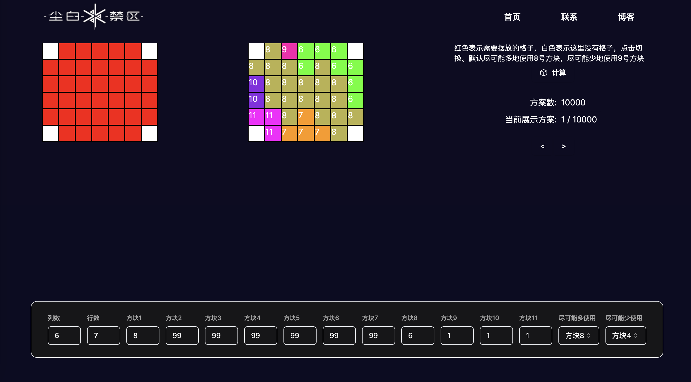

# 尘白禁区工具箱

简体中文 | [English](_content/README_en.md)

## 游戏名称

尘白禁区

Snowbreak: Containment Zone

スノウブレイク：禁域降臨

스노우 브레이크: 포비든 존

## 宿舍拼图在线解密工具

- 设置数量

- 控制方块使用的优先级（默认是：尽可能多地使用8号方块，尽可能少地使用9号方块）

## Screenshot



## 快速启动

First, run the development server:

```bash
npm run dev
# or
yarn dev
# or
pnpm dev
# or
bun dev
```

Open [http://localhost:3000](http://localhost:3000) with your browser to see the result.

You can start editing the page by modifying `app/page.tsx`. The page auto-updates as you edit the file.

This project uses [`next/font`](https://nextjs.org/docs/basic-features/font-optimization) to automatically optimize and load Inter, a custom Google Font.

## Learn More

To learn more about Next.js, take a look at the following resources:

- [Next.js Documentation](https://nextjs.org/docs) - learn about Next.js features and API.
- [Learn Next.js](https://nextjs.org/learn) - an interactive Next.js tutorial.

You can check out [the Next.js GitHub repository](https://github.com/vercel/next.js/) - your feedback and contributions are welcome!

## Deploy on Vercel

The easiest way to deploy your Next.js app is to use the [Vercel Platform](https://vercel.com/new?utm_medium=default-template&filter=next.js&utm_source=create-next-app&utm_campaign=create-next-app-readme) from the creators of Next.js.

Check out our [Next.js deployment documentation](https://nextjs.org/docs/deployment) for more details.


## Credits

- [CmdBlockZQG/cbjq: 尘白禁区 信源研析小工具](https://github.com/CmdBlockZQG/cbjq)

- [dvaJi/genshin-builds](https://github.com/dvaJi/genshin-builds)